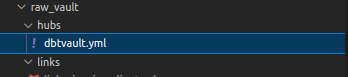
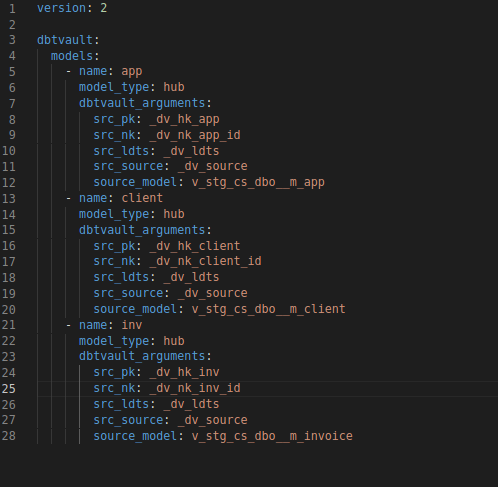
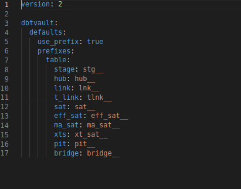
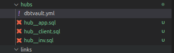
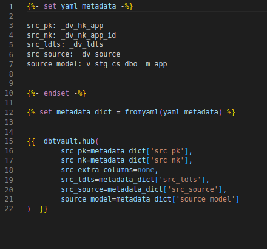
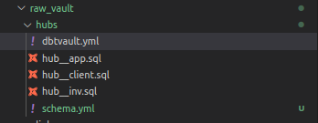
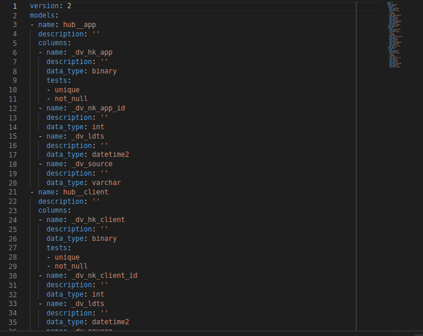

# dbtvault-generator
Generate DbtVault files from external `yml`!

## Why this exists
A good dev is a lazy dev. Let's do less work, the right way!

DBTVault is a great tool, but due to quirks of DBT (looking at you, compile context) we don't necessarily have access additional variables we want to use...at least, without overloading the `meta` or `vars` attributes. See [this issue](https://github.com/Datavault-UK/dbtvault/issues/106) for some details about the limitations and workarounds for the build context. The `dbtvault` docs used `yml` specified inside DBT `sql` files to specify its variables, or otherwise directly set the variables using `jinja`. While this is a workable solution, it's still a workaround to the fact that additional attributes can't be consumed by the `dbt compile` operation.

Using env vars as a stopgap isn't a problem on small projects, but on more complicated codebases it can quickly lead to confusion. It becomes difficult to trace which variables belong where. Further, it hinders the development of other data vault management tools being built on top of DBT. Data Vault is a metadata-heavy method of architecting a data warehouse, as the modelling discipline associated with data vault makes it ripe for automation and abstraction. A standardised modelling output format independent of env vars permits the building of GUI tools to streamline the development and expansion of the data vault.

This tool is a Python-based templating library designed to act around DBT and `dbtvault`, and allow external `dbtvault` parameterisation. It also seeks to leverage the uniformity of data vault specifications to automate certain low-level maintenance tasks such as code documentation. The primary purpose is to generate Data Vault architectures (trhough `dbtvault`), generating SQL and `schema.yml` directly from specialised `dbtvault.yml` files.

Watch this space for a GUI assistance tool in future.

## Requirements
- `python>=3.9`
- `dbt>=1.0.0` available in the Python environment
- A DBT project initialised and ready to go. The `dbtv-gen` CLI tool needs to execute from the same directory as you would normally execute DBT from.
- The DBT package `dbtvault>0.9.0` installed in the DBT project

## Overview Of Features
Depending on your set-up, install `dbtvault-generator` into your Python environment. A shim will be installed that adds `dbtv-gen` to your CLI, and you're ready to go.

The following assumes you have `dbtvault.yml` files preconfigured (see below for details).



The `dbtvault.yml` file contains the metadata required for templating the `dbtvault` library



You can also use a root-level `dbtvault.yml` to specify global defaults.



### Generate SQL Templates
In your command line of choice, run the following command:
```bash
dbtv-gen sql
```
By default, you will see the SQL files appear in the same directory as the `dbtvault.yml` file. Files can be prefixed automatically (shown), can be manually specified per-model, or ignored.


The contents of the file will match the details specified in `dbtvault.yml`.




### Generate `schema.yml` Doc Config

Once the sql has been generated, execute `dbt run` to instantiate them as views in your development environment. From here, `dbt docs generate` can be executed to build DBT's `catalog.json` artifact. `dbtvault-generator` can then use this to pre-populate a `schema.yml` file with basic documentation.

```bash
dbtv-gen docs
```




The schema file will infer certain properties about the columns. This includes the data types of the columns, read from the information schema. Unfortunately we can't yet describe the columns automatically.



In additionFor example, primary keys will automatically have `not_null` and `unique` tests added for alerting of clashes. Foreign key columns will have a `relationships` test added, but this test is conditional on a `where 1 != 1` condition to prevent it from triggering alerts. What this does do, however, is play nicely with other tools and packages that use the "relationship" test to automatically create foreign keys or similar metadata (e.g. on Snowflake) for downstream use by other tools.


Instantiating the models is currently required to build the docs. In future versions, the docs will be built directly from the config options.

### BONUS! Use `dbterd` To Generate ER Diagrams!

The wonderful [Dat Nguyen](https://github.com/datnguye) has built [a cool library called `dbterd`](https://github.com/datnguye/dbterd). `dbterd` picks up DBT's catalog and manifest artifacts and, using the relationship test, creates a `.dbml` file detailing the core relationships within your DBT catalog. The `.dbml` format is an open-source entity-relation spec that can either be consumed directly by a number of SaaS tools or by open-source tools like [DBML Renderer](https://github.com/softwaretechnik-berlin/dbml-renderer).

Importantly, `dbterd` uses the `relationships` test to identify foreign key relations...which you will have out of the box. You will need to rerun `dbt docs generate` to add in the new relationships, but

Go check out [his page on Github](https://github.com/datnguye/dbterd) for further details...and leave him a star while you're there.

## Installation Instructions

### From Pip

```bash
pip install --upgrade dbtvault-generator
```

### Direct From Git
Many package managers allow installation of Python packages direct from version control repositories. Add this repo directly with e.g.

```bash
poetry add git@github.com:Oracen/dbtvault-generator.git
```

### From Source
For now, using PDM as dependency manager as it seems to be better supported than Poetry. As such, give PDM a try! It's like Yarn for Python, or Poetry with a faster resolver and Poe built in.

```bash
git clone https://github.com/Oracen/dbtvault-generator
cd dbtvault-generator
pdm build
```

## Usage

On command execution, `dbtv-gen` scans your project directory for files named `dbtvault.yml`, containing a root-level key called `dbtvault`. The location of these files specify where any associated models will be generated, unless the target path is overriden. The only special file is an optional `dbtvault.yml` located at the project root. This file's default attributes will be treated as the defaults for the entire project, and so serves as a good place for specifying prefixes etc.

Each `dbtvault.yml` contains 2 keys:
- `defaults`: the default options for each model. These default options can be overwritten on a per-model basis
- `models`: the specification for each model to be generated in the parent folder of the current file.

The `defaults` element has the following structure:
```yaml
version: 2

dbtvault:
  defaults:
    use_prefix: true
    prefixes:
      table:
        stage: stg_
        hub: hub_
        link: lnk_
        t_link: t_lnk_
        sat: sat_
        eff_sat: eff_sat_
        ma_sat: ma_sat_
        xts: xts_
        pit: pit_
        bridge: bridge_
    custom_macros:
      stage: custom_staging_macro
    target_path: ""
```

- `use_prefix`: indicates whether to prepend the designated string to each table name as the model generates. Defaults to `false`
- `prefixes`: a mapping of prefixes to use per supported model type. Defaults are shown above, and are aligned with `dbtvault`'s examples
- `custom_macros`: sometimes the default `dbtvault` macros don't do exactly what you want and a custom macro needs to be substituted. For example, you may want to restrict your data to a small time range in the development environment. If specified, the custom macro will be substituted in for particular model structures. Defaults to `{}` (empty)
- `target_path`: The location where files will be created. It is advised to not set this on the default settings, but can be overriden on the objects attribute per-model. Defaults to `""` (empty).

The `models` element is a list of `model` elements, each of whic has the following structure:
```yaml
version: 2

dbtvault:
  models:
    - name: clients
      model_type: stage
      options:
        use_prefix: false
        target_path: "raw_vault/staging"
      dbtvault_arguments:
        include_source_columns: false
        source_model:
          main_db: clientData
        derived_columns:
          SOURCE: "!1"
          LOAD_DATETIME: "CRM_INGESTION_TIME"
        null_columns:
          LAST_TICKET_DATE: "lastTicketDate"
        hashed_columns:
          CLIENT_HASHKEY: "CLIENT_ID"
          CUSTOMER_NATION_HK:
            - "CUSTOMER_ID"
            - "NATION_ID"
        ranked_columns:
          one : "two"
```
- `name`: specifies the base name of the generated model. If `use_prefix = false`, the generated file will have this name, otherwise it will have the appropriate prefix prepended depending on its type
- `model_type`: the `dbtvault`-compliant model type. This field drives the yml schema validation, and so should throw errors if the overall model object is incorrectly specified.
- `options`: this specifies the generation options for the model, and inherits values from the defaults. The choices are the same.
- `dbtvault_arguments`: Implements the `dbtvault` macro API. Choices depend on the type of model implemented.

You can also use `!include relative/path/to/file.yml` syntax to push config out to other files. This is handy in e.g. keeping all DBTVault config in separate ymls to avoid overloading a single `.yml` file, streamlining PRs and maintenance. All included files will still require the `version` KV-pair DBT looks for, but it will be removed from any included templates. Please note; to use this functionality you'll need to add `dbtvault.yml` to your `.dbtignore` file:

```bash
# .dbtignore
dbtvault.yml
```

DBT does not support the `!include` constructor pattern.

For further information on how to specify `dbtvault` models, please see [the DBTVault macros documentation](https://dbtvault.readthedocs.io/en/latest/macros).
